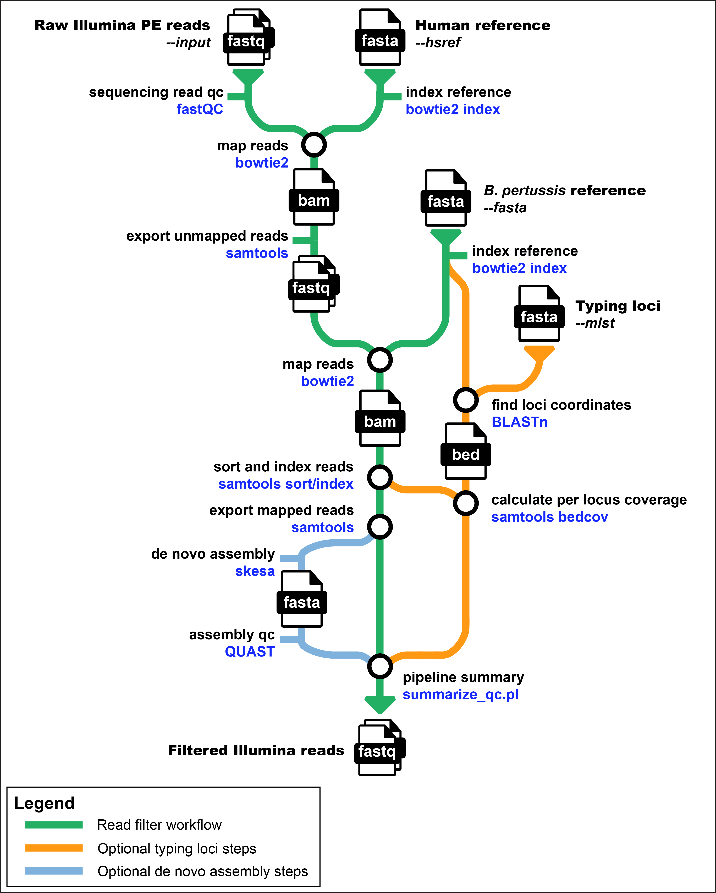

# CDC Pertussis and Diphtheria Laboratory  
### Culture-Independent Whole Genome Sequencing (CIWGS) Read Filter Pipeline 🧪🧬🖥️

[](https://www.nextflow.io/)
[](https://docs.conda.io/en/latest/)
[](https://www.docker.com/)
[](https://sylabs.io/docs/)


## Introduction

**bpertussisciwgs** is a bioinformatics best-practice analysis pipeline for processing Illumina reads prepared through Culture-Independent WGS of *B. pertussis* positive clinical specimens.

The pipeline is built using [Nextflow](https://www.nextflow.io), a workflow tool to run tasks across multiple compute infrastructures in a very portable manner. It uses Docker/Singularity containers making installation trivial and results highly reproducible. The [Nextflow DSL2](https://www.nextflow.io/docs/latest/dsl2.html) implementation of this pipeline uses one container per process which makes it much easier to maintain and update software dependencies. Where possible, these processes have been installed from [nf-core/modules](https://github.com/nf-core/modules) in order to make them available to all nf-core pipelines, and to everyone within the Nextflow community! Some documentation has been automatically generated by nf-core and may not be accurate.

## Pipeline summary

1. Raw read QC ([`FastQC`](https://www.bioinformatics.babraham.ac.uk/projects/fastqc/))
2. Subtractive read mapping to a human reference assembly ([`bowtie2`](https://bowtie-bio.sourceforge.net/bowtie2/index.shtml))
3. Positive read mapping to a *B. pertussis* reference assembly ([`bowtie2`](https://bowtie-bio.sourceforge.net/bowtie2/index.shtml)+[`samtools`](http://www.htslib.org/))
4. *Optional:* De novo assembly of filtered reads ([`skesa`](https://github.com/ncbi/SKESA)+[`QUAST`](https://quast.sourceforge.net/quast))
5. *Optional:* MLST/cgMLST/wgMLST typing gene coverage calculations ([`samtools`](http://www.htslib.org/))
5. Compute read recovery and coverage metrics ([`custom`](bin/summarize_qc.pl))
2. Present QC for raw reads ([`MultiQC`](http://multiqc.info/))

## Quick start

1. Install [`Nextflow`](https://www.nextflow.io/docs/latest/getstarted.html#installation) (`>=21.04.0`)  

    > **CDC Users:** On CDC SciComp infrastructure use:  
    ```console
    module load nextflow
    ```

2. Install any of [`Docker`](https://docs.docker.com/engine/installation/), [`Singularity`](https://www.sylabs.io/guides/3.0/user-guide/), [`Podman`](https://podman.io/), [`Shifter`](https://nersc.gitlab.io/development/shifter/how-to-use/) or [`Charliecloud`](https://hpc.github.io/charliecloud/) for full pipeline reproducibility _(please only use [`Conda`](https://conda.io/miniconda.html) as a last resort; see [docs](https://nf-co.re/usage/configuration#basic-configuration-profiles))_

    > **CDC Users:** Only singularity containers should be used on CDC SciComp infrastructure (biolinux, aspen, rosalind).

3. Clone the pipeline repo to your working environment:

    ```console
    git clone git@github.com:CDCgov/bpertussis-ciwgs.git
    ```

4. Test the pipeline using a minimal dataset using the command:

    ```console
    nextflow run Bpertussis-CIWGS/main.nf -profile test,singularity
    ```

5. Start running your own analysis!

    > Prepare a sample sheet for use as the pipeline input, which should consist of three comma-separated columns with: sample-ID, path(Read1.fastq), path(Read2.fastq). For single-end read data, only one FASTQ should be speficied. Example:
    ```console
    sample,fastq_1,fastq_2
    CONTROL_REP1,AEG588A1_S1_L002_R1_001.fastq.gz,AEG588A1_S1_L002_R2_001.fastq.gz
    ```
    > Run the pipeline:
   ```console
    nextflow run Bpertussis-CIWGS/main.nf -profile sge,singularity --input {SAMPLESHEET.csv} --outdir {OUTDIR} --fasta {BPERTUSSIS.fasta}  --hsref {PATH/TO/humanref/bowtie-index} --mlst {TYPING-GENES.fasta} --skesa true|false
    ```


## Documentation

The bpertussisciwgs pipeline comes with [documentation](./docs/) about general  
- [usage](./docs/usage.md)  
- [output](./docs/output.md)  
- [training](./docs/training.md)  

### Workflow diagram  



### Running on CDC HPC

For use on an HPC cluster (rosalind, aspen) the workflow can be run as a job by the following steps:

1) After logging in, activate the nextflow environment:

    ```console
    module load nextflow
    ```

2) Prepare file `cdc.confing` with the necessary `sge` submission parameters, add it to your [./conf/](./conf), and include it in [nextflow.config](./nextflow.config) with:  

    ```groovy
    // Load CDC config for operating on internal compute infrastructure
    includeConfig 'conf/cdc.config'
    ```

3) Submit individual processes as jobs to the scheduler using a profile defined in `cdc.config`, for example:

    ```consol
    -profile sge,singularity
    -profile sgeaspen,singularity
    ```


## Credits

The **bpertussisciwgs** workflow was originally written by [Michael R. Weigand](https://github.com/mikeyweigand).


## Contributions and Support

If you would like to contribute to this pipeline, please see the [contributing guidelines](CONTRIBUTING.md).


## Citations

An extensive list of references for the tools used by the pipeline can be found in [`CITATIONS.md`](CITATIONS.md).

Please cite:

> **Strengthening _Bordetella pertussis_ genomic surveillance by direct sequencing of residual positive specimens.**
>
> Yanhui Peng, Margaret M. Williams, Lingzi Xiaoli, Ashley Simon, Heather Fueston, M. Lucia Tondella, & Michael R. Weigand
>
> bioRxiv. 2023. doi: [10.1101/2023.12.08.570824](https://doi.org/10.1101/2023.12.08.570824) 

You can cite the `nf-core` publication as follows:

> **The nf-core framework for community-curated bioinformatics pipelines.**
>
> Philip Ewels, Alexander Peltzer, Sven Fillinger, Harshil Patel, Johannes Alneberg, Andreas Wilm, Maxime Ulysse Garcia, Paolo Di Tommaso & Sven Nahnsen.
>
> _Nat Biotechnol._ 2020 Feb 13. doi: [10.1038/s41587-020-0439-x](https://dx.doi.org/10.1038/s41587-020-0439-x).

---
## Public Domain Standard Notice
This repository constitutes a work of the United States Government and is not
subject to domestic copyright protection under 17 USC § 105. This repository is in
the public domain within the United States, and copyright and related rights in
the work worldwide are waived through the [CC0 1.0 Universal public domain dedication](https://creativecommons.org/publicdomain/zero/1.0/).
All contributions to this repository will be released under the CC0 dedication. By
submitting a pull request you are agreeing to comply with this waiver of
copyright interest.

## License Standard Notice
The repository utilizes code licensed under the terms of the Apache Software
License and therefore is licensed under ASL v2 or later.

This source code in this repository is free: you can redistribute it and/or modify it under
the terms of the Apache Software License version 2, or (at your option) any
later version.

This source code in this repository is distributed in the hope that it will be useful, but WITHOUT ANY
WARRANTY; without even the implied warranty of MERCHANTABILITY or FITNESS FOR A
PARTICULAR PURPOSE. See the Apache Software License for more details.

You should have received a copy of the Apache Software License along with this
program. If not, see http://www.apache.org/licenses/LICENSE-2.0.html

The source code forked from other open source projects will inherit its license.

## Privacy Standard Notice
This repository contains only non-sensitive, publicly available data and
information. All material and community participation is covered by the
[Disclaimer](https://github.com/CDCgov/template/blob/master/DISCLAIMER.md)
and [Code of Conduct](https://github.com/CDCgov/template/blob/master/code-of-conduct.md).
For more information about CDC's privacy policy, please visit [http://www.cdc.gov/other/privacy.html](https://www.cdc.gov/other/privacy.html).

## Contributing Standard Notice
Anyone is encouraged to contribute to the repository by [forking](https://help.github.com/articles/fork-a-repo)
and submitting a pull request. (If you are new to GitHub, you might start with a
[basic tutorial](https://help.github.com/articles/set-up-git).) By contributing
to this project, you grant a world-wide, royalty-free, perpetual, irrevocable,
non-exclusive, transferable license to all users under the terms of the
[Apache Software License v2](http://www.apache.org/licenses/LICENSE-2.0.html) or
later.

All comments, messages, pull requests, and other submissions received through
CDC including this GitHub page may be subject to applicable federal law, including but not limited to the Federal Records Act, and may be archived. Learn more at [http://www.cdc.gov/other/privacy.html](http://www.cdc.gov/other/privacy.html).

## Records Management Standard Notice
This repository is not a source of government records, but is a copy to increase
collaboration and collaborative potential. All government records will be
published through the [CDC web site](http://www.cdc.gov).

## Additional Standard Notices
Please refer to [CDC's Template Repository](https://github.com/CDCgov/template)
for more information about [contributing to this repository](https://github.com/CDCgov/template/blob/master/CONTRIBUTING.md),
[public domain notices and disclaimers](https://github.com/CDCgov/template/blob/master/DISCLAIMER.md),
and [code of conduct](https://github.com/CDCgov/template/blob/master/code-of-conduct.md).
